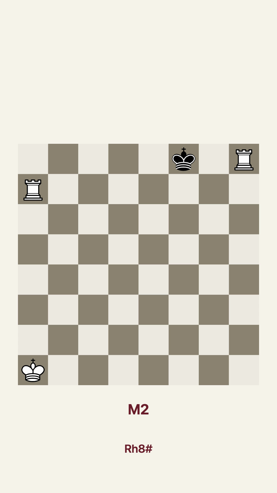
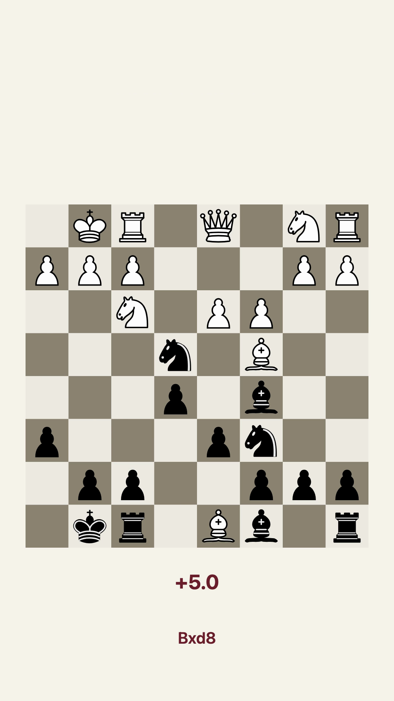
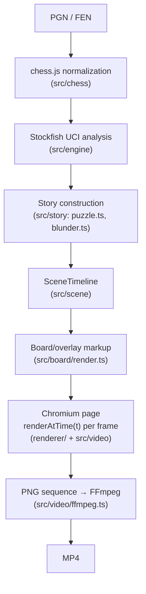

# Chessroll

> Turn chess positions into short-form stories.

Chessroll is a deterministic TypeScript/Node CLI that turns PGN games and FEN positions into polished 1080×1920 vertical videos, in the spirit of chess Shorts/Reels — but rendered from real Stockfish analysis and real chess rules, not screen-recorded from a website.

```text
PGN / FEN → chess model → Stockfish analysis → story → scene timeline → renderAtTime(t) → MP4
```

**Status: two templates working end-to-end — `puzzle` and `blunder`.** This is not yet the full product described in [`ROADMAP.md`](./ROADMAP.md)/[`BLUEPRINT.md`](./BLUEPRINT.md); see [Roadmap](#roadmap) below for exactly what's built versus planned.

## Demo

No GitHub Pages site exists yet (see [Roadmap](#roadmap)), but the canonical demo videos are committed under [`demo/`](./demo) — click a poster to play the MP4:

| Puzzle                                                                                                                                                          | Blunder                                                                                                                                                     |
| --------------------------------------------------------------------------------------------------------------------------------------------------------------- | ----------------------------------------------------------------------------------------------------------------------------------------------------------- |
| [](demo/puzzle/demo.mp4)                                                                       | [](demo/blunder/demo.mp4)                                                                        |
| [`demo/puzzle/position.fen`](demo/puzzle/position.fen) — a mate-in-2 rook "staircase": find the move, countdown, oxblood reveal, forced continuation to `Rh8#`. | [`demo/blunder/game.pgn`](demo/blunder/game.pgn) — an original short game where `15...Nxe4??` opens the diagonal to a hanging queen, punished by `16.Bxd8`. |

Regenerate either locally:

```bash
pnpm install && pnpm build
node dist/cli.js demo/puzzle/position.fen --template puzzle -o demo/puzzle/demo.mp4 --show-eval
node dist/cli.js demo/blunder/game.pgn --template blunder -o demo/blunder/demo.mp4 --show-eval
```

## What Chessroll does

Given a chess position or game, Chessroll:

1. Normalizes the input through [chess.js](https://github.com/jhlywa/chess.js) — never hand-rolls chess legality.
2. Analyzes the relevant position(s) with a real Stockfish process over UCI, caching results on disk.
3. Selects/builds a **story**: a specific narrative for the chosen template (a puzzle's solve/reveal, a blunder's swing/punishment).
4. Compiles the story into a **scene timeline**: a sequence of segments, each a pure, static description of what's on screen.
5. Renders every frame with a single deterministic function of time, `renderAtTime(t)`, inside a headless Chromium page.
6. Encodes the PNG sequence to an H.264 MP4 with FFmpeg.

Every step is inspectable independently — see [Debugging](#debugging).

## Templates

| Template    | Input  | Status     | Description                                                                                                                                                                                                                                              |
| ----------- | ------ | ---------- | -------------------------------------------------------------------------------------------------------------------------------------------------------------------------------------------------------------------------------------------------------- |
| `puzzle`    | FEN    | ✅ done    | Position → prompt → countdown → oxblood reveal → best move → forced continuation → payoff.                                                                                                                                                               |
| `blunder`   | PGN    | ✅ done    | Auto-detects (or `--move` forces) the game's most severe mistake → hook → quick lead-in → the blunder move plays (unflagged) → freeze → "spot the mistake?" → countdown → reveal (highlighted + evaluation swing) → engine's actual punishment → payoff. |
| `replay`    | PGN    | 🚧 planned | Full game replay with importance-weighted move timing.                                                                                                                                                                                                   |
| `game60`    | PGN    | 🚧 planned | A game compressed into ~60s.                                                                                                                                                                                                                             |
| `guess`     | PGN    | 🚧 planned | Pause before a selected move, guess what was played.                                                                                                                                                                                                     |
| `brilliant` | PGN    | 🚧 planned | Centered on one standout tactical/strategic move.                                                                                                                                                                                                        |
| `auto`      | either | 🚧 planned | Analyze, pick the strongest story, choose a template automatically.                                                                                                                                                                                      |

## Quick start

```bash
pnpm install                # also runs `playwright install chromium` (postinstall)
pnpm build                  # bundles src/{cli,debug-cli}.ts -> dist/, renderer/ -> renderer/dist/
node dist/cli.js test/fixtures/puzzle.fen --template puzzle -o puzzle.mp4
```

### FEN example (`puzzle`)

```bash
node dist/cli.js --fen "6k1/8/8/8/8/8/R7/K6R w - - 0 1" --template puzzle -o mate-in-2.mp4 --show-eval
```

### PGN example (`blunder`)

```bash
node dist/cli.js test/fixtures/blunder-game.pgn --template blunder -o blunder.mp4 --show-eval
# Force a specific ply instead of auto-detecting (1-based ply index):
node dist/cli.js test/fixtures/blunder-game.pgn --template blunder --move 16 -o forced.mp4
```

## Installation

Requirements:

- Node.js 22+
- [pnpm](https://pnpm.io/)
- [Stockfish](https://stockfishchess.org/) on `PATH`, or pass `--engine <path>` per invocation
- FFmpeg/ffprobe on `PATH`

```bash
pnpm install
```

`postinstall` runs `playwright install chromium` automatically.

## Stockfish setup

```bash
# macOS
brew install stockfish
# Debian/Ubuntu
apt install stockfish
```

Chessroll discovers `stockfish` on `PATH` by default; override per run with `--engine /path/to/stockfish`. Analysis settings (`--depth`/`--nodes`, `--threads`, `--hash`, `--multipv`) are explicit and cached on disk, keyed by FEN + engine version + those settings — upgrading Stockfish invalidates stale cache entries automatically. See `src/engine/{uci,stockfish,cache,normalize}.ts`.

## CLI

```text
chessroll <input> [options]

Input:
  <input>                 .fen file (puzzle) or .pgn file (blunder)
  --fen <fen>              inline FEN, instead of an input file (puzzle only)

Options:
  -o, --output <path>      output MP4 path (default: <input basename>.mp4)
  --template <name>        "puzzle" (default, needs FEN) or "blunder" (needs PGN)
  --move <n>                1-based ply to force as the blunder (blunder only)
  --orientation <side>      white | black | auto
  --fps <n>                  frames per second (default 30)
  --width <px>               output width (default 1080)
  --height <px>              output height (default 1920)
  --engine <path>            path to the Stockfish binary
  --depth <n>                 search depth (default 18)
  --nodes <n>                 search node limit (mutually exclusive with --depth)
  --threads <n>                engine threads (default 1)
  --hash <mb>                   engine hash size in MB (default 128)
  --multipv <n>                  engine MultiPV (default 1)
  --countdown <seconds>          puzzle/blunder solve countdown (default 5)
  --show-eval / --no-eval         reveal the evaluation at payoff (default hidden)
  --coordinates / --no-coordinates board coordinates (not yet drawn — accepted, not visual yet)
  --keep-temp                      keep the temporary frame directory
  --no-cache                        bypass the analysis cache
  --verbose / --quiet
  --version / -h, --help
```

Exit codes are stable once published (`src/utils/errors.ts`): `1` unexpected failure, `2` invalid CLI arguments, `3` missing input, `4` invalid PGN/FEN, `5` missing dependency (Stockfish/FFmpeg/Chromium), `6` engine analysis failure, `7` story construction failure, `8` rendering failure, `9` encoding failure, `10` output/filesystem failure.

`chessroll-debug` is a separate binary for inspecting a scene without rendering a full video — see [Debugging](#debugging).

## Engine analysis

Stockfish is driven directly over UCI (`src/engine/uci.ts` — spawn → `uci`/`uciok` → `setoption` → `isready`/`readyok` → `position`/`go`/`info`/`bestmove`). Raw scores are always relative to the side to move; `src/engine/normalize.ts` is the single place they get flipped to White's perspective, and it's the only place mate scores get formatted (`M3`/`-M2`) — they are never coerced into a fake centipawn value anywhere else in the codebase. `blunder`'s detector unifies cp and mate scores onto one internal _ranking_ scale purely to compare severity (a mate always outranks any realistic cp swing); that value is never surfaced as a display string.

## Deterministic rendering

Every frame is a pure function of its timestamp:

```ts
const t = n / fps;
const state = stateAtTime(timeline, t); // src/scene/state.ts — no wall clock, no prior-frame dependency
```

A `SceneTimeline` is a list of segments, each holding a static `SceneDescriptor`. Move-animation progress is derived from `t` against a `MoveAnimation`'s own `start`/`end`, using a fixed easing function (`src/scene/interpolation.ts`) — never a CSS transition. `renderer/renderer.css` is asserted, in a unit test, to contain no `transition`/`animation`/`@keyframes` rule at all.

## Visual identity

```text
Background   #F6F3EC   warm off-white
Primary      #171717   near-black
Accent       #6B1F2A   oxblood — last move, reveals, arrows, evaluation
Secondary    #6B6B68
```

The board squares/overlays use Chessroll's own tokens above. Pieces are [lichess.org](https://lichess.org)'s default **cburnett** set by Colin M.L. Burnett — vendored unmodified at `renderer/assets/pieces/cburnett/` and embedded in `src/board/pieces.ts` — used under its GPLv2+ license (see [Licensing](#licensing)). Board square colors and typography (currently a system font stack) are flagged in `src/board/theme.ts` as defaults still pending visual sign-off — nothing here is final art direction.

## Architecture



`src/scene/**` and `src/board/**` are the shared pure core: bundled into _both_ the Node CLI and the browser (`renderer/renderer.ts`), enforced by a dedicated `tsconfig.renderer.json` project and an ESLint rule banning `node:*` imports there.

Full source layout:

```text
src/
  cli.ts, debug-cli.ts, index.ts   entrypoints + renderVideo() orchestrator
  chess/     PGN/FEN loading, normalized Ply/ChessGame model
  engine/    Stockfish UCI, normalization, disk cache, analyzeGame()
  story/     puzzle.ts, blunder.ts — chess+analysis -> SceneTimeline
  scene/     pure timeline types, interpolation, stateAtTime()
  board/     geometry, theme, cburnett piece set, moves, arrows, render.ts
  video/     Playwright capture, ffmpeg encode, ffprobe validation
  config/    CLI-flag resolution and defaults
  utils/     exit-code errors, temp dirs, executable discovery
renderer/    the Chromium-loaded page (index.html, renderer.ts, renderer.css)
test/        unit/ (no external processes) · integration/ (real Stockfish/Chromium) · e2e/ (full pipeline gates)
```

## Debugging

`chessroll-debug` inspects any stage without rendering a full video:

```bash
node dist/debug-cli.js test/fixtures/puzzle.fen --dump-game game.json
node dist/debug-cli.js test/fixtures/puzzle.fen --analyze --depth 12 --output analysis.json
node dist/debug-cli.js test/fixtures/puzzle.fen --story puzzle --output story.json
node dist/debug-cli.js test/fixtures/puzzle.fen --template puzzle --time 7.5 --output frame.png
```

`--dump-game` accepts both `.fen` and `.pgn` input; `--analyze`/`--story`/`--time` are currently scoped to FEN/puzzle (a `.pgn` input for those returns a clear error, not a silent misbehavior).

## Testing

```bash
pnpm typecheck && pnpm lint && pnpm format
pnpm test:unit          # pure logic, no external processes
pnpm test:integration   # real Stockfish / real Chromium via Playwright
pnpm test:e2e           # full-pipeline acceptance gates (puzzle, blunder)
pnpm test               # everything — 129 tests as of this writing
```

Chess-correctness fixtures (`test/fixtures/`) — castling both directions, en passant, promotion/underpromotion, checkmate, stalemate, and the puzzle/blunder demo positions — are each verified programmatically against chess.js (and, for the demo fixtures, against the real Stockfish binary) rather than hand-derived. This caught a real bug during development: chess.js's own `isCapture()` excludes en passant, which would have produced an incorrect `Ply.flags.capture`.

## GitHub Pages

Not yet built. `demo/` already has the canonical assets (source + MP4 + poster per template — see [Demo](#demo)); `site/` will host a static page in the same visual identity showing each template's source alongside its rendered output, deployed via a minimal-permissions GitHub Actions workflow. Tracked in [Roadmap](#roadmap).

## Roadmap

Done (this repository, current state):

- Normalized chess model (FEN + PGN), verified special-move fixtures
- Deterministic SVG board/overlay renderer, lichess's cburnett piece set
- Stockfish UCI integration, score normalization, disk cache
- `puzzle` and `blunder` templates, full CLI + debug CLI
- Playwright capture → FFmpeg encode pipeline
- Canonical demo assets for both working templates (`demo/puzzle/`, `demo/blunder/`)
- 129 tests across unit/integration/e2e, including two full-pipeline acceptance gates

Not yet built — see [`ROADMAP.md`](./ROADMAP.md) and [`BLUEPRINT.md`](./BLUEPRINT.md) for the full spec:

- `replay`, `game60`, `guess`, `brilliant`, `auto` templates (and their demo assets)
- A GitHub Pages showcase site (`site/`)
- CI (`ci.yml`/`demo.yml`/`pages.yml`)
- Optional sound design
- Visual-regression testing and a finalized visual pass (current board square colors are placeholders, see [Visual identity](#visual-identity))

## Licensing

Chessroll's own code is [MIT](./LICENSE), with one asset exception:

| Files                                                                                                                   | Author                                                            | License                                            |
| ----------------------------------------------------------------------------------------------------------------------- | ----------------------------------------------------------------- | -------------------------------------------------- |
| `renderer/assets/pieces/cburnett/*.svg` (vendored unmodified) and the equivalent inline markup in `src/board/pieces.ts` | [Colin M.L. Burnett](https://en.wikipedia.org/wiki/User:Cburnett) | [GPLv2+](https://www.gnu.org/licenses/gpl-2.0.txt) |

This is lichess.org's own default piece set (`public/piece/cburnett` in [lichess-org/lila](https://github.com/lichess-org/lila), see their [COPYING.md](https://github.com/lichess-org/lila/blob/master/COPYING.md)), used here by explicit choice to render immediately recognizable pieces rather than a bespoke set. If you redistribute or modify these specific SVG files, GPLv2+ terms apply to them — see [`THIRD_PARTY_NOTICES.md`](./THIRD_PARTY_NOTICES.md).

Famous games' moves/metadata may be used where legally appropriate, but copyrighted annotations, commentary, or proprietary puzzle explanations are never copied — the `blunder` demo fixture, for instance, is an original short game, not a real recorded game.

## Contributing

This is an early-stage personal project without a formal contribution process yet. Read [`AGENTS.md`](./AGENTS.md) for the non-negotiable engineering constraints (determinism, chess correctness, engine-score normalization, visual identity) before proposing changes — issues and PRs are welcome once the repository is public.
